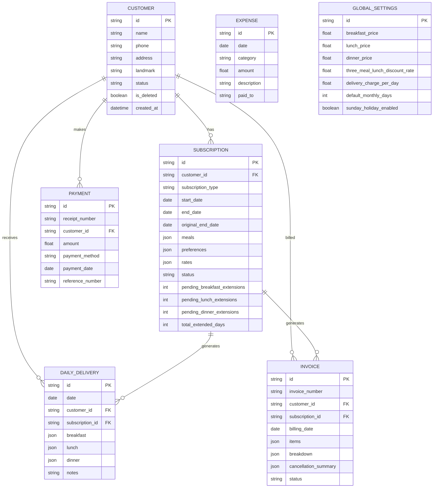

# Entity Relationship (ER) Diagram

```mermaid
erDiagram
    CUSTOMER ||--o{ SUBSCRIPTION : "has"
    CUSTOMER ||--o{ DAILY_DELIVERY : "receives"
    CUSTOMER ||--o{ INVOICE : "billed"
    CUSTOMER ||--o{ PAYMENT : "makes"
    SUBSCRIPTION ||--o{ DAILY_DELIVERY : "generates"
    SUBSCRIPTION ||--o{ INVOICE : "generates"

    CUSTOMER {
        string id PK
        string name
        string phone
        string address
        string landmark
        string status
        boolean is_deleted
        datetime created_at
    }

    SUBSCRIPTION {
        string id PK
        string customer_id FK
        string subscription_type
        date start_date
        date end_date
        date original_end_date
        json meals
        json preferences
        json rates
        string status
        int pending_breakfast_extensions
        int pending_lunch_extensions
        int pending_dinner_extensions
        int total_extended_days
    }

    DAILY_DELIVERY {
        string id PK
        date date
        string customer_id FK
        string subscription_id FK
        json breakfast
        json lunch
        json dinner
        string notes
    }

    INVOICE {
        string id PK
        string invoice_number
        string customer_id FK
        string subscription_id FK
        date billing_date
        json items
        json breakdown
        json cancellation_summary
        string status
    }

    PAYMENT {
        string id PK
        string receipt_number
        string customer_id FK
        float amount
        string payment_method
        date payment_date
        string reference_number
    }

    EXPENSE {
        string id PK
        date date
        string category
        float amount
        string description
        string paid_to
    }

    GLOBAL_SETTINGS {
        string id PK
        float breakfast_price
        float lunch_price
        float dinner_price
        float three_meal_lunch_discount_rate
        float delivery_charge_per_day
        int default_monthly_days
        boolean sunday_holiday_enabled
    }
```
