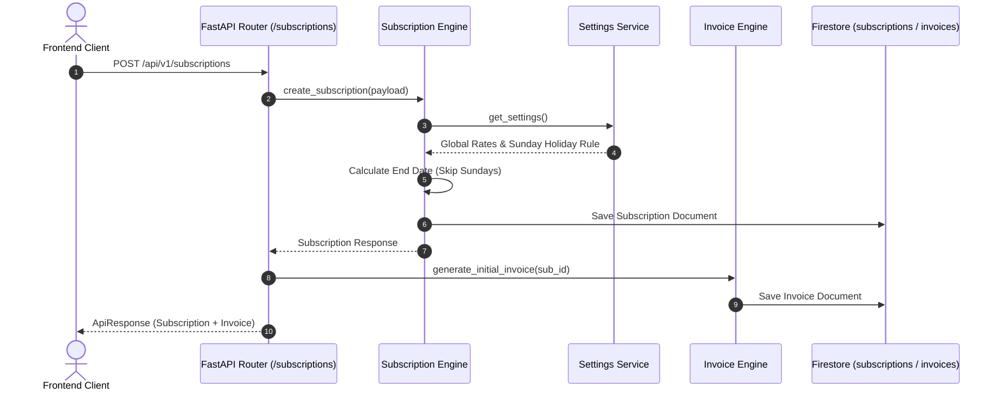
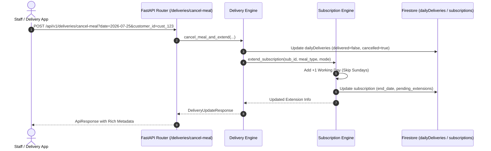
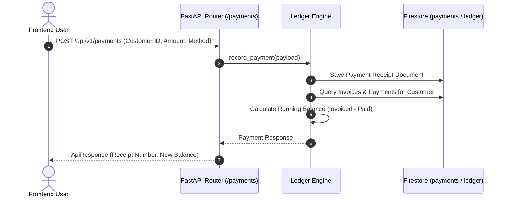

# Sequence Diagrams

## 1. Subscription Creation & Invoice Generation Workflow

```mermaid
sequenceDiagram
    autonumber
    actor Client as Frontend Client
    participant API as FastAPI Router (/subscriptions)
    participant SubEngine as Subscription Engine
    participant Settings as Settings Service
    participant InvEngine as Invoice Engine
    participant DB as Firestore (subscriptions / invoices)

    Client->>API: POST /api/v1/subscriptions
    API->>SubEngine: create_subscription(payload)
    SubEngine->>Settings: get_settings()
    Settings-->>SubEngine: Global Rates & Sunday Holiday Rule
    SubEngine->>SubEngine: Calculate End Date (Skip Sundays)
    SubEngine->>DB: Save Subscription Document
    SubEngine-->>API: Subscription Response
    API->>InvEngine: generate_initial_invoice(sub_id)
    InvEngine->>DB: Save Invoice Document
    API-->>Client: ApiResponse (Subscription + Invoice)
```

---

## 2. Daily Meal Cancellation & Extension Workflow

```mermaid
sequenceDiagram
    autonumber
    actor Staff as Staff / Delivery App
    participant API as FastAPI Router (/deliveries/cancel-meal)
    participant DelEngine as Delivery Engine
    participant SubEngine as Subscription Engine
    participant DB as Firestore (dailyDeliveries / subscriptions)

    Staff->>API: POST /api/v1/deliveries/cancel-meal?date=2026-07-25&customer_id=cust_123
    API->>DelEngine: cancel_meal_and_extend(...)
    DelEngine->>DB: Update dailyDeliveries (delivered=false, cancelled=true)
    DelEngine->>SubEngine: extend_subscription(sub_id, meal_type, mode)
    SubEngine->>SubEngine: Add +1 Working Day (Skip Sundays)
    SubEngine->>DB: Update subscription (end_date, pending_extensions)
    SubEngine-->>DelEngine: Updated Extension Info
    DelEngine-->>API: DeliveryUpdateResponse
    API-->>Staff: ApiResponse with Rich Metadata
```

---

## 3. Payment Processing & Ledger Balance Workflow

```mermaid
sequenceDiagram
    autonumber
    actor User as Frontend User
    participant API as FastAPI Router (/payments)
    participant LedgerEngine as Ledger Engine
    participant DB as Firestore (payments / ledger)

    User->>API: POST /api/v1/payments (Customer ID, Amount, Method)
    API->>LedgerEngine: record_payment(payload)
    LedgerEngine->>DB: Save Payment Receipt Document
    LedgerEngine->>DB: Query Invoices & Payments for Customer
    LedgerEngine->>LedgerEngine: Calculate Running Balance (Invoiced - Paid)
    LedgerEngine-->>API: Payment Response
    API-->>User: ApiResponse (Receipt Number, New Balance)
```
